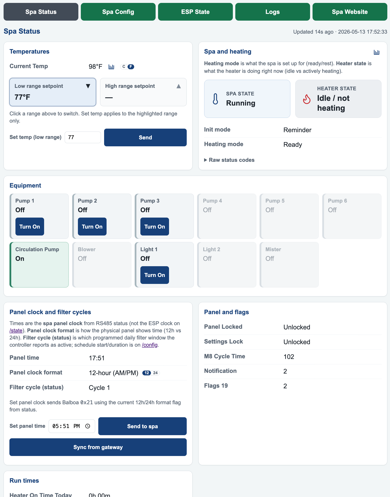
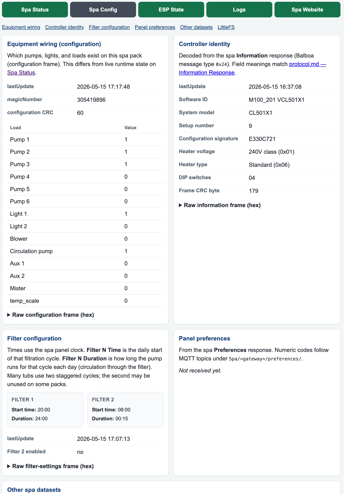
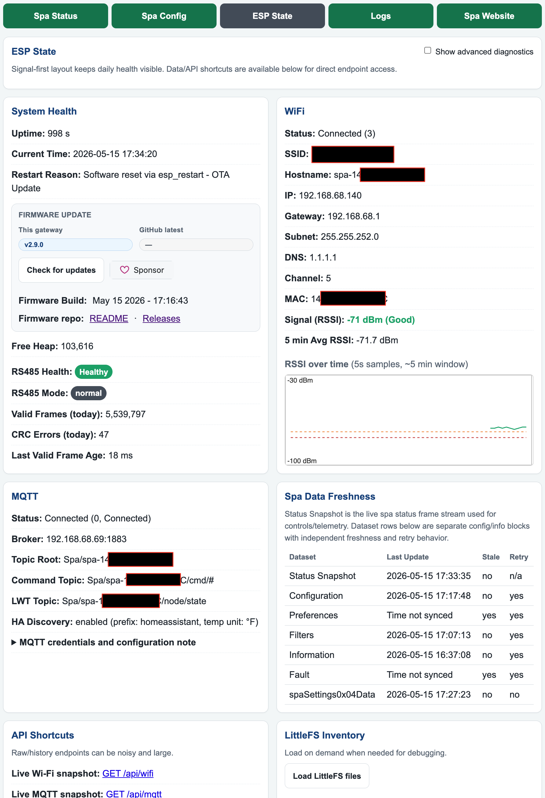
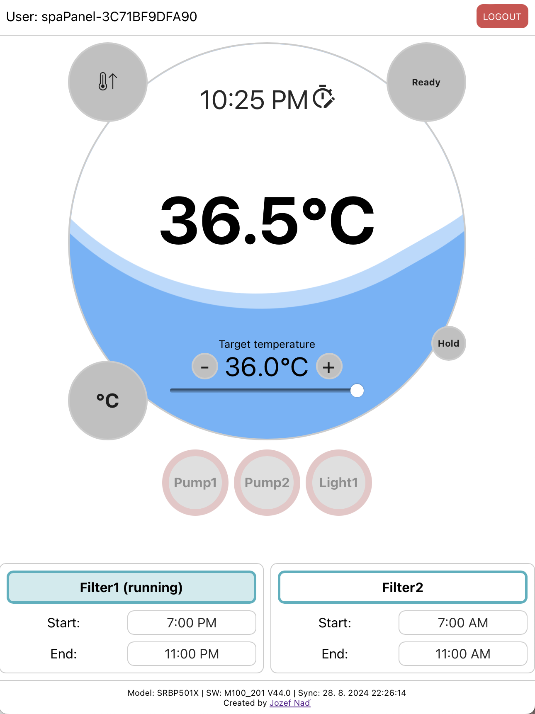
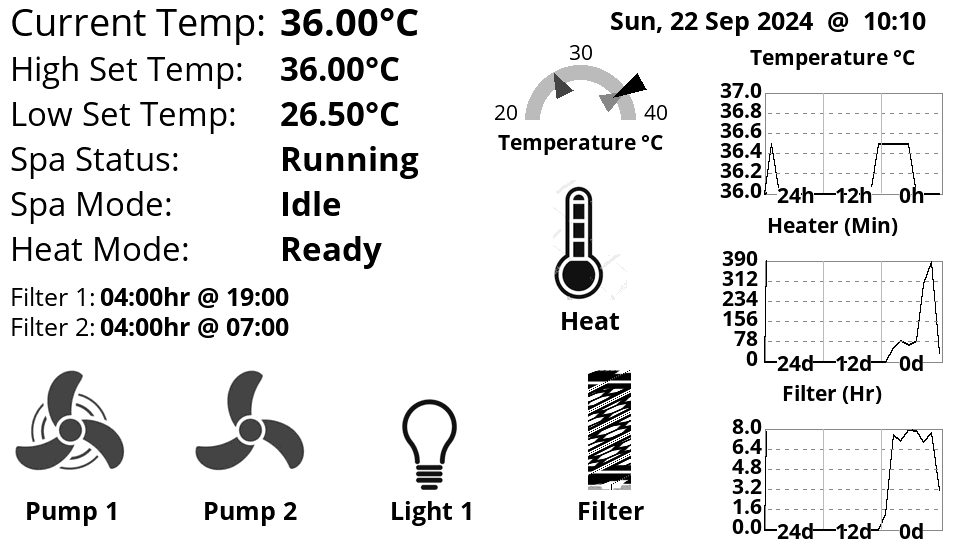

# esp32_balboa_spa

**Local Wi‑Fi gateway for Balboa spas — read and control your tub over RS485, with a web portal and Home Assistant-friendly MQTT.**

## Overview

Many Balboa hot tubs already communicate on an **RS485** bus inside the cabinet. Factory panels and vendor apps work fine day to day, but they rarely expose full status and control on **your home network** in a form you can automate. This project adds a small **ESP32 Wi‑Fi module** as a peer on that bus. You **do not** replace the Balboa controller—the gateway listens and sends the same kinds of frames the panel uses, while the physical spa panel keeps working.

The result: water temperature, pumps, lights, setpoint, heating mode, and related panel commands become available on your LAN through a **browser**, **MQTT**, and **Home Assistant**, without routing everyday spa use through a vendor cloud.

### Why people build this

- **Local-first** — Status and control stay on **your Wi‑Fi**; basic use does not depend on a vendor cloud account.
- **Home automation** — **MQTT** telemetry plus **Home Assistant MQTT Discovery** (device **Balboa Spa** in HA): dashboards, automations, and voice assistants through Home Assistant.
- **Everyday convenience** — Phone-friendly **`/status`**: live temp, equipment, setpoint, and v1 controls without opening the tub cabinet each time.
- **Visibility** — **`/config`** and **`/state`** for equipment layout, controller identity, Wi‑Fi/RS485 health, logs, and JSON APIs when you need to debug.
- **Low recurring cost** — Roughly **$30–50** in parts for the documented M5 stack (below); an MQTT broker is optional and is often already running with Home Assistant.

This is **moderate DIY**, not a sealed appliance: you need a safe **RS485 tap**, comfort with **PlatformIO flash** and **`config.h`**, and time to verify frames on **`/status`** before you rely on automations.

### What you need

- **Required:** Balboa spa with RS485 access ([ccutrer physical layer](https://github.com/ccutrer/balboa_worldwide_app/wiki#physical-layer)); **2.4 GHz Wi‑Fi**; USB for the first firmware upload. Not sure if your tub qualifies? See the wiki [Spa controllers and brands](https://github.com/shomanjk/esp32_balboa_spa/wiki/Spa-controllers-and-brands) catalog (identify the pack label first).
- **Recommended (documented tub-side stack):** [M5 Atom Lite](https://docs.m5stack.com/en/core/ATOM%20Lite) + [Atomic RS485 Base](https://docs.m5stack.com/en/atom/Atomic%20RS485%20Base) — two boards that stack; the base includes the RS485 transceiver and 12→5 V for the Atom ([M5 tub-side section](#m5-atom-lite--atomic-rs485-base-tub-side)).
- **Also supported:** Generic ESP32 dev board + RS485 module (default UART **GPIO 16/17** in [`src/config-example.h`](src/config-example.h)).
- **Optional:** MQTT broker / Home Assistant; a second device only for an [ePaper remote display](#epaper-remote-display-optional) or the legacy [TCP bridge](#optional-homebridge-and-tcp-bridge-bridge) (Homebridge).

**Hardware complexity:** software follows a checklist; the variable step is finding the correct **A/B** tap on your controller and confirming traffic on the bus.

### How hard is setup?

| Step | Effort |
|------|--------|
| Clone repo + `balboa-spa` submodule | One-time |
| Copy `src/config.h` from [`config-example.h`](src/config-example.h); set Wi‑Fi (+ MQTT if desired) | ~10 minutes |
| `pio run -e M5AtomLite-tub -t upload` then `-t uploadfs` | Longer the first time PlatformIO/toolchains install |
| Wire RS485 A/B; confirm **`/status`** updates | Depends on tub access |

**Start here:** [Wiki · Getting started](https://github.com/shomanjk/esp32_balboa_spa/wiki/Getting-started) (source: [`wiki/Getting-started.md`](wiki/Getting-started.md)). Build details: [Build with PlatformIO](#build-with-platformio); tub OTA: [OTA updates](#ota-updates-m5-atom-tub-side).

### What you get

- **Monitor** — Live status (temps, pumps, lights, heating mode, filter info) on **`/status`**; configuration (including **editable filter schedules** and **config backup/restore**) on **`/config`**.
- **Control (v1)** — Pump/light/blower/mister toggles, **set temperature**, **temp units**, **panel clock** from **`/status`** and SCI **`/devices/sci`**; the same command set on **MQTT** `Spa/<gateway>/cmd/…` (see [MQTT and Home Assistant](#mqtt-and-home-assistant)). The LittleFS **`balboa-spa`** tab may differ—treat it as read-first unless you verify your build ([Web interface](#web-interface)).
- **Integrate** — MQTT publish; **Home Assistant discovery**; optional **TCP bridge on port 4257** for [homebridge-plugin-bwaspa](https://github.com/vincedarley/homebridge-plugin-bwaspa).
- **Operate** — Built-in web UI; **`/logs`** with WebSocket tail; **OTA** (`M5AtomLite-tub-ota`); RS485 health and history via **`/api/rs485`** and related JSON routes.
- **Optional** — Kitchen **ePaper** display (`REMOTE_CLIENT`); **Telnet** log listener only if you enable **`TELNET_LOG`** at compile time.

*Best fit if you run (or want) Home Assistant, prefer local control, and are comfortable with a weekend wiring-and-flash project—not if you need a vendor-supported, plug-and-play cloud replacement.*

**Changelog:** [CHANGELOG.md](CHANGELOG.md) (release history and compare links).

**For developers:** One firmware tree supports multiple **build roles**—tub-side **RS485** gateway (`LOCAL_CLIENT`), **UDP discovery** (`LOCAL_CONNECT`), optional **TCP bridge** (`BRIDGE`), optional **Telnet** logging (`TELNET_LOG`), and a **TCP client + ePaper** remote role (`REMOTE_CLIENT`). See [Compiler definitions](#compiler-definitions) and [AGENTS.md](AGENTS.md).

## About this fork

**Lineage:** Firmware and documentation build on the ESP32 port **[NorthernMan54/esp32_balboa_spa](https://github.com/NorthernMan54/esp32_balboa_spa)** (branch **`ESP32`**). Ongoing changes are tracked from **[shomanjk/esp32_balboa_spa](https://github.com/shomanjk/esp32_balboa_spa)** (`origin` for typical clones). The ESP8266-era appendix in the [collapsed snapshot](#inherited-readme-snapshot) comes from [cribskip/esp8266_spa](https://github.com/cribskip/esp8266_spa) via NorthernMan54’s README; those older repos are **not** the target for day-to-day pull requests from this line.

**Maintained here (this fork):**

- **[M5 Atom Lite + Atomic RS485 Base](#m5-atom-lite--atomic-rs485-base-tub-side)** tub-side wiring, **`M5_STATUS_LED`**, and related **PlatformIO** environments in [`platformio.ini`](platformio.ini).
- **RS485** robustness, diagnostics, and **JSON APIs** (`/api/rs485`, `/api/rs485/raw`, `/api/rs485/history`) — see [CHANGELOG.md](CHANGELOG.md).
- **Web** portal for `/status`, `/config`, `/state` (responsive layout, Wi‑Fi chart, **live spa + heating polling**, **RS485 command controls** on `/status`, firmware version on `/state`) and **`GET /api/version`**, **`/api/diagnostics`**, **`/api/wifi`**, **`/api/status/controls`**, etc.
- **MQTT** telemetry on `Spa/<gateway>/…` topics and **Home Assistant MQTT Discovery** (retained `homeassistant/…/config`); optional `config.h` overrides — see [MQTT and Home Assistant](#mqtt-and-home-assistant).
- **OTA** workflow for tub-side Atom builds.

**Also inherited in code (may still matter to you):**

- **`BRIDGE`** / TCP port **4257** for LAN clients such as [homebridge-plugin-bwaspa](https://github.com/vincedarley/homebridge-plugin-bwaspa) — summarized under [Optional: Homebridge and TCP bridge](#optional-homebridge-and-tcp-bridge-bridge).
- **Remote + ePaper** build profile (`REMOTE_CLIENT`, `spaEpaper`) — see [ePaper remote display](#epaper-remote-display-optional).

**Pointers:** [CHANGELOG.md](CHANGELOG.md) · [Roadmap](#roadmap) · [GitHub Releases](https://github.com/shomanjk/esp32_balboa_spa/releases) · [Wiki](https://github.com/shomanjk/esp32_balboa_spa/wiki) (source in [`wiki/`](wiki/)) · [FORK.md](FORK.md) · [AGENTS.md](AGENTS.md) · [Sponsor on GitHub](https://github.com/sponsors/shomanjk).

## License

This repository uses **multiple licenses**; see [`LICENSE`](LICENSE).

| Component | License | Commercial sale |
|-----------|---------|-----------------|
| **Firmware** (`src/`, `lib/`, build tooling, docs, etc.) | [PolyForm Noncommercial 1.0.0](LICENSE-firmware) | Not allowed without separate permission from the licensor |
| **Web UI** (`balboa-spa/` submodule) | [Apache-2.0](balboa-spa/LICENSE) | Allowed when Apache-2.0 conditions are met |

**Firmware:** You may use, modify, and share the firmware for **noncommercial**
purposes (personal hobby use, research, education, and similar) under
[`LICENSE-firmware`](LICENSE-firmware). To **sell** hardware or services that
include this firmware, or otherwise use it commercially, contact the maintainer
via [GitHub Issues](https://github.com/shomanjk/esp32_balboa_spa/issues).

**Web UI:** The `balboa-spa` submodule remains **Apache-2.0** and may be used
commercially under that license.

Vendored files and PlatformIO/npm dependencies have their own notices; see
[`THIRD_PARTY_NOTICES.md`](THIRD_PARTY_NOTICES.md). Keep upstream license
headers intact when redistributing those files.

---

## Usage history and analytics

- Caching of hot tub configuration to reduce traffic to the spa controller and improve client responsiveness.
- **Temperature:** 10-minute samples for **24 hours** (144 points) in RTC RAM (soft reboot keeps the series; power loss clears until it refills). Hourly LittleFS persist (`/TempHist.bin`) is **parked** after field panics on the write path — see [`docs/temp-history-littlefs-panic.md`](docs/temp-history-littlefs-panic.md).
- Daily tracking of heater on-time (seconds), 24 days of history.
- Daily tracking of filter on-time (seconds), 24 days of history.

---

## Roadmap

Planned or deferred enhancements (not commitments; order and timing vary).

- **ePaper temperature UOM** — When building with **`spaEpaper`**, align [`lib/spaEpaper/spaEpaper.cpp`](lib/spaEpaper/spaEpaper.cpp) labels and chart titles with **`spaStatusData.tempScale`** (same °F/°C and decimal rules as the firmware **`/status`** page).
- **Equipment display names** — On the spa config page (or a dedicated settings area), let users assign friendly names per equipment slot (e.g. Pump 1 → "Lounger Jets", Pump 2 → "Deep Chair Jets"). Store names in firmware-backed nonvolatile storage so labels survive reboots and stay consistent across the web UI (`balboa-spa` + [`lib/spaWebServer/spaWebServer.cpp`](lib/spaWebServer/spaWebServer.cpp) APIs as needed). Optional later: expose the same labels to MQTT / Home Assistant discovery if useful.
- **`TELNET_LOG` (optional Telnet listener)** — Implementation in [`lib/wifiModule/wifiModule.cpp`](lib/wifiModule/wifiModule.cpp) starts **TelnetStream** on TCP **23** when the compile flag is set; **`Log`** remains on **`webLogBufferGetLogPrint()`** (Serial + web ring). **Default [`platformio.ini`](platformio.ini) envs omit the flag** (no listener). A future **non-blocking** duplicate log sink over raw TCP/Telnet remains possible if operators want **`nc`**-style tailing without mirroring the global logger (mutex / WDT constraints).

---

## Web interface

**Layout:** Firmware-served pages `/status`, `/config`, and `/state` use a responsive layout (viewport scaling, wrapping nav, fluid charts/images) for phone-sized screens.

### Screenshots — firmware portal

#### Spa status (`/status`)



#### Spa configuration (`/config`)



#### ESP state (`/state`)



- Operator-first layout: **System Health** hero (uptime, clock, RS485 badge, restart reason) and Wi-Fi (status badge, SSID/hostname, RSSI summary + network/signal grid) at the top.
- `Show advanced diagnostics` reveals memory/build/RS485-today sub-cards, gateway reboot, RS485 deep counters (today vs yesterday table), and time-debug internals on demand.
- Advanced mode includes `API Shortcuts` links for `/api/wifi`, `/api/version`, `/api/diagnostics`, `/api/rs485`, `/api/rs485/raw`, and `/api/rs485/history`.

### JSON API (`GET`)

| Path | Query | Purpose |
| --- | --- | --- |
| `/api/version` | — | Firmware identity: `version`, `build`, `hostname`, `ip`, `restartReason`, `espResetReason`, `lastRestartIntent`, plus GitHub update-check URLs. |
| `/api/diagnostics` | — | Gateway post-mortem: `deviceUptimeMs`, RTC `faultLog`, `lastBridgeIngress`, chip temp (`chipTempC` / status fields), `panelClockAutoSync`; also echoes `version` / `hostname` / `ip`. |
| `/api/wifi` | — | Wi‑Fi station: `connected`, `status` / `statusName`, `mac`, `hostname`; when connected: `ssid`, `rssi`, `ip`, `gateway`, `subnet`, `dns`, `channel`. |
| `/api/rs485` | — | UART pins, baud, `autoTx`, byte/frame/CRC counters, polarity (`normal` / `inverted_rx_tx`), lock state, `health`. |
| `/api/rs485/raw` | `limit` (default **80**, cap **256**) | Bounded recent RX bytes: `bytesHex`, `items[]` with `tMs`, `gapMs`, `byte`, `mode`, `uartAvailable`. |
| `/api/rs485/history` | `limit` (default **20**, cap **60**) | Rolling RS485 snapshots (newest first): per-snapshot `health`, counters, `mode`, `detectPhase`. |
| `/api/status/controls` | — | Live snapshot for **`/status`** polling: pumps, lights, temps, **spa/heating** fields, setpoint bounds, and snapshot freshness metadata. |
| `/api/config/filter` | — | Filter 1/2 schedule (`ready`, `lastUpdate`, start/duration fields). **POST** JSON body applies via **`spaSetFilterCycles`**. |
| `/api/config/export` | — | Download spa config JSON (`writable` + `snapshot` + `readiness`). |
| `/api/config/import` | — | **POST** JSON to preview (`dryRun: true`) or apply writable settings; optional **`force`** for identity mismatch. |

### LittleFS SPA bundle (optional)

Credit for the SPA web app: [jozefnad/balboa-spa](https://github.com/jozefnad/balboa-spa) (this repo pins a fork as a submodule — see [Build with PlatformIO](#build-with-platformio)).



**Status:** Firmware-served **`/status`** includes **wired** equipment, temperature, panel-clock, and **12h/24h format** controls (SCI **`Button`** / **`SetTemp`** / **`SystemTime`** / **`TimeFormat`** to the spa over RS485). **`/config`** supports **filter schedule editing** and **JSON backup/restore**. The **LittleFS** `balboa-spa` bundle uses the same SCI **`Filters`** paths for filter read/write; other control surfaces may still differ from upstream — treat as **read-first** unless you verify them for your build.

---

## ePaper remote display (optional)



Display builds use the [LilyGo T5 ePaper](https://www.lilygo.cc/en-ca/products/t5-4-7-inch-e-paper-v2-3?srsltid=AfmBOopva5B_jxFAsa86Fn75lR66ZpcsqNLJEqPG4Axu8zeuCEEeqI0D). **Note:** upstream ePaper development has stalled because a reference device [stopped working](https://github.com/Xinyuan-LilyGO/LilyGo-EPD47/issues/137); treat this path as best-effort.

---

## MQTT and Home Assistant

**Telemetry:** With Wi‑Fi and broker settings in `config.h` (`MQTT_SERVER`, `MQTT_PORT`, credentials), the gateway publishes spa state under `Spa/<gateway>/…` (see [AGENTS.md](AGENTS.md)).

**MQTT commands:** The gateway subscribes `Spa/<gateway>/cmd/#` and dispatches commands to the shared spa dispatcher. Command outcomes are published as JSON on `Spa/<gateway>/cmd/result`.

### Command write scope (v1)

To keep protocol risk low, command-write implementation is intentionally staged:

- **In scope (v1) — implemented on web + MQTT paths:**
  - **Button toggle** commands (Balboa `0x11`) from **`/devices/sci`** and firmware **`/status`** (including temp-range item **80** / `0x50`).
  - **Set temperature** commands (Balboa `0x20`) with **protocol** min/max by °F/°C and active high/low range ([`spaProtocolActiveSetpointBand`](lib/spaMessage/spaCommandDispatcher.cpp)).
  - **Set temperature units** (`TempUnits`, Balboa `0x27`) via `C`/`F`.
- **Also in scope (v1):**
  - **Set panel clock** (`SystemTime`, Balboa `0x21`) via `HH:MM` or gateway sync.
  - **Filter cycle schedules** (Balboa `0x23`) via **`/config`**, **`GET/POST /api/config/filter`**, SCI **`Filters`**, and **MQTT** **`cmd/filter`** (+ granular **`cmd/filter/filter{1,2}/…`** sub-topics).
  - **Config backup/restore** — **`GET /api/config/export`**, **`POST /api/config/import`** (writable settings only; identity snapshots for warnings).
- **Also in scope (v1) — web and config export/import only (no MQTT topic yet):**
  - **Panel clock format** (`TimeFormat`, Balboa `0x21` piggyback) — SCI **`TimeFormat`** (`12`/`24`), **`/status`** controls, export/import **`clockFormat`**.
- **Deferred (post-v1):**
  - MQTT **`cmd/timeFormat`** (or equivalent) for panel 12h/24h
  - Raw configuration / preferences frame writes (`0x2E`, `0x26` beyond temp scale)

### MQTT command topics (v1)

- `Spa/<gateway>/cmd/setTemp` -> numeric payload (`102`, `39.5`)
- `Spa/<gateway>/cmd/setTime` -> `HH:MM`
- `Spa/<gateway>/cmd/syncTime` -> any non-empty payload (uses gateway local time)
- `Spa/<gateway>/cmd/mode` -> `heat` or `off` (Ready/Rest)
- `Spa/<gateway>/cmd/preset` -> `Low Range` or `High Range`
- `Spa/<gateway>/cmd/tempUnits` -> `C`/`Celsius` or `F`/`Fahrenheit`
- `Spa/<gateway>/cmd/filter` -> JSON (`filter1` / `filter2` objects; same fields as **`POST /api/config/filter`**). Omitted fields merge from the live spa cache.
- `Spa/<gateway>/cmd/filter/filter1/start` -> `HH:MM` or `H:MM` (e.g. `08:00`)
- `Spa/<gateway>/cmd/filter/filter1/duration` -> `HH:MM` duration (e.g. `04:30`)
- `Spa/<gateway>/cmd/filter/filter2/start` -> `HH:MM` (enables Filter 2)
- `Spa/<gateway>/cmd/filter/filter2/duration` -> `HH:MM` (enables Filter 2)
- `Spa/<gateway>/cmd/filter/filter2/enabled` -> `true`/`false`/`on`/`off`/`1`/`0`
- `Spa/<gateway>/cmd/button/<code>` ->
  - non-pump: `on`, `off`, `toggle`
  - pumps: `Off`, `Low`, `High` (single-speed pumps accept `Off`/`Low`)
- Result telemetry: `Spa/<gateway>/cmd/result` JSON (`target`, `value`, `accepted`, `reason`)

All command frame semantics should be validated against the ccutrer protocol reference before enabling each command family:
- [ccutrer/balboa_worldwide_app `doc/protocol.md`](https://github.com/ccutrer/balboa_worldwide_app/blob/main/doc/protocol.md)

To avoid repeating dead-end experiments while command-write behavior is being debugged, keep the running attempt ledger up to date:
- [`docs/command-write-debug-log.md`](docs/command-write-debug-log.md)

**Home Assistant MQTT Discovery:** After each successful MQTT connect, the firmware publishes **retained** discovery configs under `homeassistant/<platform>/<object_id>/config`. In Home Assistant, entities appear under the MQTT integration as device **Balboa Spa**.

- **Temperature values:** `current_temp`, `set_temp`, `low_set_temp`, `high_set_temp`, `sensor_a`, `sensor_b` are numeric temperature sensors.
- **Writable controls:** `climate` (`spa_controls`), load `switch` entities (`light1`, `light2`, `blower`, `mister`), pump controls by capability (**1-speed pumps as `switch`**, **2-speed pumps as `select`**), a `button` for panel-time sync, and diagnostic `sensor` for last command result.
- **Enum/categorical values:** `heating_state`, `spa_state`, `init_mode`, `heating_mode`, `filter_mode`, `temp_range` publish human-readable strings and are discovered as enum sensors (not numeric measurements).
- **Filter running:** `filter1_running` and `filter2_running` publish `On`/`Off` from live controller **`filterMode`** (discovered as **`binary_sensor`**).
- **Binary values:** `panel_locked`, `settings_lock`, `circ`, `blower`, `light1`, `light2`, `mister` are binary sensors with explicit on/off payloads.
- **Clock entity:** `spa_time` is intentionally **not** discovered in HA to avoid noisy, non-actionable history churn.
- **Gateway WiFi signal:** MQTT **`node/rssi`** (dBm, ~90s with other **`node/`** telemetry). HA diagnostic sensor **`Gateway WiFi signal`** is **disabled by default** — open the **Balboa Spa** device in HA → enable under **Diagnostic** to chart or automate on RSSI.
- **Device web link:** Discovery sets `device.configuration_url` to `http://<gatewayName>.local/status` so the HA device page can open the ESP web status page directly.

- **Broker:** Use the Home Assistant [MQTT integration](https://www.home-assistant.io/integrations/mqtt/) on the **same broker** as the ESP32. Default discovery prefix is `homeassistant/` (override with `MQTT_DISCOVERY_PREFIX` in `config.h` / defaults in [`lib/mqttModule/mqttModule.h`](lib/mqttModule/mqttModule.h)).
- **Temperature unit:** Discovery uses a static `unit_of_measurement` (default **°F**). For Celsius tubs, set `MQTT_HA_TEMP_UNIT` in `config.h` (see [`src/config-example.h`](src/config-example.h)).
- **Web-link hostname:** `configuration_url` uses mDNS (`<gatewayName>.local`). If your network does not resolve mDNS, use a DHCP reservation + local DNS, or open the device by IP from HA.
- **Disable discovery:** `#define MQTT_HA_DISCOVERY 0` in `config.h`.

---

## Optional: Homebridge and TCP bridge (`BRIDGE`)

When **`BRIDGE`** is enabled at build time, the firmware exposes a **TCP server on port 4257** that can pair with the Homebridge plugin **[homebridge-plugin-bwaspa](https://github.com/vincedarley/homebridge-plugin-bwaspa)**. This path is **legacy/community** relative to the MQTT + HA focus of this fork; it remains in the codebase for compatibility. See compiler flags below.

### Bridge-first raw troubleshooting harness

For short-lived command-write troubleshooting, you can inject raw Balboa frames over the bridge without reflashing:

- Harness script: [`scripts/bridge_raw_tester.py`](scripts/bridge_raw_tester.py)
- Example matrix input: [`docs/bridge-raw-command-matrix.example.json`](docs/bridge-raw-command-matrix.example.json)
- Troubleshooting ledger: [`docs/command-write-debug-log.md`](docs/command-write-debug-log.md)

Single-case run:

```
python3 scripts/bridge_raw_tester.py \
  --host <spa-ip-or-hostname> \
  --frame-hex "7e070abf110400137e" \
  --label "toggle_pump1_item4"
```

Matrix run:

```
python3 scripts/bridge_raw_tester.py \
  --host <spa-ip-or-hostname> \
  --matrix docs/bridge-raw-command-matrix.example.json \
  --out docs/local/bridge-raw-last-run.json
```

Guardrails:

- Use one command sequence at a time and keep cooldowns between retries.
- Record expected vs observed behavior for each run in the debug ledger.
- If repeated runs are mostly malformed-frame/operator errors, consider phase 2: add a thin typed HTTP helper endpoint.

---

## Build with PlatformIO

Builds use **PlatformIO** ([`platformio.ini`](platformio.ini)).

### Firmware and LittleFS (first install)

1. Flash **firmware**: `pio run -e <env> -t upload`
2. Flash the **filesystem** (web bundle): `pio run -e <env> -t uploadfs`

The LittleFS assets live under **`balboa-spa/dist`** ([`data_dir`](platformio.ini)); they are **not** embedded in the firmware binary by default. Skipping **`uploadfs`** leaves the bundled SPA / static files missing until you upload the filesystem. Repeat **`uploadfs`** when the web bundle changes.

Step-by-step checklist (clone, `config.h`, USB & OTA): **[`wiki/Getting-started.md`](wiki/Getting-started.md)** (published copy: [GitHub wiki · Getting started](https://github.com/shomanjk/esp32_balboa_spa/wiki/Getting-started)).

### Compile-time feature flags (how to change)

Feature **macros** are enabled with **`-DNAME`** strings under each environment’s **`build_flags`** in [`platformio.ini`](platformio.ini).

1. Open the **`[env:…]`** block you use (for example **`M5AtomLite-tub`**, **`M5AtomLite-tub-ota`**, **`ESP32-epd47`**). For generic tub-side ESP32 dev boards (**`ESP32ota`**, **`ESP32usb`**, **`ESP32prodOta`**), shared flags live in **`[env:ESP32tub]`** — edit that block (affects all three). For flags that apply to **one** child env only, add **`build_flags`** there **after** **`${env:ESP32tub.build_flags}`** so inherited tub flags are kept (a bare child list replaces the base and drops **`LOCAL_CLIENT`** / **`BRIDGE`**, etc.).
2. Add or remove lines like `'-DTELNET_LOG'` inside that block’s **`build_flags =`** list. Most envs also include **`${com.build_flags}`**, which pulls in the shared **`[com]`** defaults (including **`LOG_LEVEL_*`** for ArduinoLog).
3. Rebuild with **`pio run -e <env>`** (and **`-t upload`** / **`-t uploadfs`** when you need them).

For **what each flag does**, see **[Compiler definitions](#compiler-definitions)** below. **Wi‑Fi, MQTT, RS485 pins, and OTA passwords** live in **`src/config.h`** (copy from [`src/config-example.h`](src/config-example.h)); those are **runtime configuration**, not the same as these **`-D`** compile switches.

### Web UI submodule

The SPA web UI lives in the **`balboa-spa`** git submodule:

- Fork remote: `https://github.com/shomanjk/balboa-spa.git`
- Upstream for merging SPA changes: `https://github.com/jozefnad/balboa-spa.git`

After clone or fresh checkout:

```
git submodule update --init --recursive
```

The LittleFS pre-build script [`scripts/extra_script.py`](scripts/extra_script.py) **requires** an initialized submodule and fails fast with guidance if it is missing.

---

## M5 Atom Lite + Atomic RS485 Base (tub-side)

This fork documents **tub-side** builds on the [M5 Atom Lite](https://docs.m5stack.com/en/core/ATOM%20Lite) stacked on the [Atomic RS485 Base](https://docs.m5stack.com/en/atom/Atomic%20RS485%20Base) (TTL ↔ RS‑485, **SP3485EE**, built-in **12 V→5 V** DC‑DC for the Atom). Generic ESP32 dev boards remain supported; see [`src/config-example.h`](src/config-example.h) for default GPIO **16/17** on **generic** envs.

- **PlatformIO environment:** `M5AtomLite-tub` in [`platformio.ini`](platformio.ini) uses `board = m5stack-atom` and partition table `spa_module.csv` (4MB class builds).
- **Pins (env-owned):** `M5AtomLite-tub` / `-ota` set UART2 **RX = GPIO 22**, **TX = GPIO 19**, and **`AUTO_TX`** via `build_flags` — omit pin overrides in `config.h` (use `#ifndef` guards from [`config-example.h`](src/config-example.h)). If you see no frames, verify **A/B** on the spa bus (swap if needed); optional **120 Ω** termination between A and B for long runs per M5 guidance.
- **Power:** The base can step **12 V** to **5 V** for the Atom; follow M5 **VH‑3.96** pinout and your controller’s accessory supply. **12 V/GND** are not the same as RS‑485 **A/B** — use the Balboa [physical layer](https://github.com/ccutrer/balboa_worldwide_app/wiki#physical-layer) notes. Bench: **USB 5 V** is fine.
- **Factory spa connector (field report):** On at least one **Balboa BP501** board, a **Molex `0451320403`** plug housing ([DigiKey `WM16117-ND`](https://www.digikey.com/short/p5ctrr0m)) mates directly with the **factory-wired header** on the controller so you can run a short harness to the Atomic base without cutting the OEM harness. You still need correct **crimp terminals** and pinout verification — see wiki [Hardware field notes · Parts that worked](https://github.com/shomanjk/esp32_balboa_spa/wiki/Hardware-field-notes#parts-that-worked-community).
- **RGB LED (`M5AtomLite-tub` / `M5AtomS3Lite-tub`):** **`M5_STATUS_LED`** + **`M5_STATUS_LED_PIN`** (Atom Lite GPIO **27**, AtomS3 Lite GPIO **35**, FastLED): **green** = Wi‑Fi has IP; **red** = disconnected; **blue/yellow** flashes bracket RS485 loop work (coarse activity, not per-byte TX/RX); **green/orange** alternate = RS485 problem while Wi‑Fi is up — **fast** = safe mode (UART skipped), **slow** = UART up but no valid spa frames — see [`src/led_control.cpp`](src/led_control.cpp).

Copy [`src/config-example.h`](src/config-example.h) to `src/config.h`, set Wi‑Fi / MQTT, then `pio run -e M5AtomLite-tub`.

**Panel clock auto-sync:** New `config-example.h` sets **`AUTO_SYNC_PANEL_CLOCK 1`** so the gateway can set the spa panel time once per boot after Wi‑Fi/NTP (when drift exceeds 2 minutes). Existing **`config.h`** files without this line keep auto-sync **off** until you add it. Requires correct **`GMT_OFFSET`** / **`DAYLIGHT_OFFSET`**.

**Alternate wiring:** **Tail485** ([tail stack](https://docs.m5stack.com/en/atom/tail485)) and **Unit RS485** ([Grove](https://docs.m5stack.com/en/unit/rs485)) on Atom Lite use **`M5AtomLite-tub`** with the **`#undef` / 32/26 block** in [`src/config-example.h`](src/config-example.h). **Generic esp32dev tub boards:** **`ESP32usb`** (first USB flash), then **`ESP32ota`** (OTA) — not **`ESP32serial`** (remote client). Atom Lite MCU is **ESP32-PICO-D4**. Use **`AUTO_TX true`**; separate **DE/RE GPIO from the Atom is not supported**. See wiki **[alternate RS485 (32/26 pins)](https://github.com/shomanjk/esp32_balboa_spa/wiki/Hardware-targets#atom-lite--alternate-rs485-3226-pins)**.

### M5 AtomS3 Lite (bench / bring-up)

Envs **`M5AtomS3Lite-tub`** (USB CDC) and **`M5AtomS3Lite-tub-ota`** (espota) for the [AtomS3 Lite](https://docs.m5stack.com/en/core/AtomS3%20Lite) (SKU **C124** — **not** the display AtomS3 / AtomS3R). `board = esp32-s3-devkitc-1`; Atomic RS485 Base pins **RX 5 / TX 6** from the env; RGB status LED via **`M5_STATUS_LED`** (FastLED, GPIO **35** — same colors as Atom Lite). Prefer **OTA** after the first USB flash if CDC upload is flaky. Desk bring-up without disturbing an installed Atom Lite: wiki **[Hardware targets](https://github.com/shomanjk/esp32_balboa_spa/wiki/Hardware-targets)** (source: [`wiki/Hardware-targets.md`](wiki/Hardware-targets.md)).

---

## OTA updates (M5 Atom tub-side)

- **ArduinoOTA** is enabled from Wi‑Fi connect ([`lib/wifiModule/wifiModule.cpp`](lib/wifiModule/wifiModule.cpp)); serial logs show hostname/IP.
- Use **`M5AtomLite-tub-ota`** or **`M5AtomS3Lite-tub-ota`** (`upload_protocol = espota`). Copy [`platformio_local.ini.example`](platformio_local.ini.example) to **`platformio_local.ini`** (gitignored) and set `upload_port` to `spa-XXXXXXXXXXXX.local` or the device IP — or pass `--upload-port` on the CLI.

```
pio run -e M5AtomLite-tub-ota -t upload
pio run -e M5AtomS3Lite-tub-ota -t upload
```

- **Auth:** Off by default; set `ENABLE_OTA_AUTH` + `OTA_PASSWORD` in `config.h` for stricter LANs.
- **Recovery:** Keep USB flashing via **`M5AtomLite-tub`** or **`M5AtomS3Lite-tub`** if OTA fails (AtomS3 Lite CDC can be finicky — OTA is often easier after the first USB flash).
- **Visibility:** `/state` shows firmware version/build; **`GET /api/version`** returns JSON for dashboards.
- **Runbook:** [`OTA_LOGGING_WORKFLOW.md`](OTA_LOGGING_WORKFLOW.md).

---

## Compiler definitions

| Flag | Role |
|------|------|
| **`LOCAL_CLIENT`** | RS485 to spa controller (tub-side). |
| **`REMOTE_CLIENT`** | TCP client to tub-side gateway (remote/kitchen device). |
| **`LOCAL_CONNECT`** | UDP discovery on port **30303** (Balboa-style discovery). |
| **`BRIDGE`** | TCP server on **4257** (Homebridge plugin path). |
| **`TELNET_LOG`** | Optional. When set, starts **TelnetStream** on TCP **23**; **`Log`** stays on Serial + web ring ([`lib/wifiModule/wifiModule.cpp`](lib/wifiModule/wifiModule.cpp)). **Omitted** in default [`platformio.ini`](platformio.ini) tub/OTA envs. |
| **`spaEpaper`** | ePaper UI (ESP32-S3 T5 env, etc.). |
| **`M5_STATUS_LED`** | (Optional, M5 tub envs) Onboard WS2812 status LED via FastLED; pair with **`M5_STATUS_LED_PIN`** (**27** Atom Lite, **35** AtomS3 Lite). |

### Example: spa / tub-side gateway

```
'-DLOCAL_CONNECT'
'-DLOCAL_CLIENT'
'-DBRIDGE'
```

Add **`-DTELNET_LOG`** only if you want the optional Telnet listener (not enabled in the checked-in tub/OTA envs).

### Example: remote ePaper module

[LilyGo T5 ePaper](https://www.lilygo.cc/en-ca/products/t5-4-7-inch-e-paper-v2-3?srsltid=AfmBOopva5B_jxFAsa86Fn75lR66ZpcsqNLJEqPG4Axu8zeuCEEeqI0D):

```
'-DREMOTE_CLIENT'
'-DspaEpaper'
```

---

## Background and credits

ESP32 port and modernization of earlier Balboa Wi‑Fi module work. References:

- [cribskip/esp8266_spa](https://github.com/cribskip/esp8266_spa) — ESP8266 reference implementation.
- [EmmanuelLM/esp8266_spa](https://github.com/EmmanuelLM/esp8266_spa) — related ESP8266 material (e.g. wiring diagrams linked from historical READMEs).
- [ccutrer/balboa_worldwide_app](https://github.com/ccutrer/balboa_worldwide_app) — [wiki](https://github.com/ccutrer/balboa_worldwide_app/wiki) and [protocol.md](https://github.com/ccutrer/balboa_worldwide_app/blob/master/doc/protocol.md).

---

<h2 id="inherited-readme-snapshot">Inherited README snapshot (NorthernMan54, branch ESP32)</h2>

The block below is a **frozen copy** of [`README.md` on branch `ESP32`](https://github.com/NorthernMan54/esp32_balboa_spa/blob/ESP32/README.md) as of this documentation pass. It preserves the original **HomeAssistant integration** wording, **Homebridge** first-person note, **compiler definitions**, **cribskip** appendix, OpenHab image, ESP8266 parts list, and **TODO** for historical context. For **accurate** Home Assistant behavior on **this** fork, use [MQTT and Home Assistant](#mqtt-and-home-assistant) above.

<details>
<summary><strong>Show inherited README (NorthernMan54 <code>ESP32</code>)</strong></summary>

# esp32_balboa_spa

WiFI Enable your Balboa SPA using a ESP32 module connected to your spa controller using rs485 interface to Balboa SPA Controller.

Multimode code base, with multiple user interfaces available. Interfaces include MQTT, Web and ePaper display.

Code base can also operate in client mode to a remote implementation of the code base in the Hot Tub. This allows for creating a ePaper display in a central location.

In my setup I have the code base deployed twice, one connected to the Balboa spa controller via rs485. And a second deployment on a [LilyGo T5 ePaper Display](https://www.lilygo.cc/en-ca/products/t5-4-7-inch-e-paper-v2-3?srsltid=AfmBOopva5B_jxFAsa86Fn75lR66ZpcsqNLJEqPG4Axu8zeuCEEeqI0D) that is mounted to the kitchen so you can see the temperature etc.

## Advanced Features

* Caching of hot tub configuration, to reduce number of calls to SPA Controller and improve responsiveness of client applications
* 10-minute temperature samples for 24 hours (144 points), hourly flash persist when changed
* Daily tracking of heater on time in seconds. Keeps 24 days of history
* Daily Tracking of filter on time in seconds. Keeps 24 days of history

## This is the ePaper display


Display is based on the [LilyGo T5 ePaper Display](https://www.lilygo.cc/en-ca/products/t5-4-7-inch-e-paper-v2-3?srsltid=AfmBOopva5B_jxFAsa86Fn75lR66ZpcsqNLJEqPG4Axu8zeuCEEeqI0D)

Pls note I have stopped development of ePaper functionality, as my device [stopped working.](https://github.com/Xinyuan-LilyGO/LilyGo-EPD47/issues/137)

## This is the web site
Credit for the code goes to https://github.com/jozefnad/balboa-spa


Currently the WebSite buttons are not working. I never got around to wiring them up.

## Integration with Homebridge

I have used this with the homebridge plugin [homebridge-plugin-bwaspa](https://github.com/vincedarley/homebridge-plugin-bwaspa) to control and automate my Hot Tub.

## MQTT Interface

MQTT Commands are not working yet. I never got around to wiring them up.

# Code Base Build

For the build I use platformio.

## Compiler Definitions

 * LOCAL_CLIENT - Connects to a local SPA via rs485 connection
 * REMOTE_CLIENT - Connects to a remote SPA via TCP / WiFi Module interface 
 * LOCAL_CONNECT - Enable discovery of ESP32 module via the Balboa discovery protocol
 * BRIDGE - Enable local TCP Server - Can be leveraged by https://github.com/vincedarley/homebridge-plugin-bwaspa
 * TELNET_LOG - Enables serial logging via a telnet interface
 * spaEpaper - Enables ePaper display

### In spa configuration

For the unit deployed in the spa, and connected to the Balboa spa controller via rs485 I use these compiler definitions.

```
  '-DLOCAL_CONNECT'
  '-DLOCAL_CLIENT'
  '-DBRIDGE'
  '-DTELNET_LOG'
```

### Remote module configuration

This is for the [LilyGo T5 ePaper Display](https://www.lilygo.cc/en-ca/products/t5-4-7-inch-e-paper-v2-3?srsltid=AfmBOopva5B_jxFAsa86Fn75lR66ZpcsqNLJEqPG4Axu8zeuCEEeqI0D)

```
  '-DREMOTE_CLIENT'
  '-DspaEpaper'
```

## Background / History

This is port of the package to run on an ESP32 Device, and modernization of the package

Based on the great work over at \
https://github.com/cribskip/esp8266_spa
https://github.com/ccutrer/balboa_worldwide_app/wiki
https://github.com/ccutrer/balboa_worldwide_app/blob/master/doc/protocol.md

# Original README by cribskip

# esp8266_spa
Control for a Balboa spa controller using the esp8266 (tested on BP2100 and BP601 series)

The sketch connects to the tub, gets an ID and spits out the state to the MQTT broker on topics "Spa/#".
You can control the tub using the subscribed topics, f.e. "Spa/light" with message "ON" for maximum compatability with openhab.

Maybe you need to adjust the sketch to your tub configuration (number of pumps, connection of blower, nr of lights...). You may find the DEBUG comments useful for this task.

Bonus: you may add several relays or such like I did ;-)

# Getting started
- Make sure your Spa is using a Balboa controller
- This is known to work on and developed on a BP2100G0 and BP601 series controllers. Yours may be compatible.
- Get the parts
- Flash the esp8266 fom the Arduino IDE or PlatformIO
- Connect everything together
- Hook up on the Spa
- Enjoy and get tubbin' ;-)

# Parts
- Get a esp8266, perferable a Wemos D1 Pro in case you need to attach a seperate antenna
- RS485 bus transceiver, (for example the "ARCELI TTL To RS485 Adapter 485 Serial Port UART Level Converter Module 3.3V 5V")
- A DC-DC converter for powering from the Tub (LM2596 for example)
- breadboard, wire etc...


# Hardware connections

- Look up finding the right wires on https://github.com/ccutrer/balboa_worldwide_app/wiki#physical-layer
- Connect the DC-DC converter to the supply wires (+ and Ground) from the Tub
- Set the DC-DC converter to output 3.3V. This output voltage (+ Ground) should then connect to the Wemos D1 Mini Pro and the RS485 transceiver
- Connect the RS485 transceiver to the A and B wires
- Connect the esp8266-TX to the RS485 TX
- Connect the esp8266-RX to the RS485 RX


# Debug
- First, check your voltages - the system is running at 3.3V
- The RX (and to some extent the TX) LEDs of the RS485 transceiver (if using the one above) should light up as data goes through. If that is the case, you know data is being converted from RS485 to TTL
- The Wemos D1 Mini Pro should spit out data to the MQTT broker (MQTT Spy can be useful here to see: 1. that it is connected to the wifi; 2. that it is connected to the broker). If that is the case, you know the device can communicate over MQTT
- Swap A and B - in my personal experience, if A & B are the wrong way round, the hot tub display (if you have one) will display (NO COMM) as the RS485 traffic get garbled by the esp8266_spa

# Appetiser using OpenHab...


# HomeAssistant integration
The system uses HomeAssistant autodiscover and should just appear in the MQTT Integration under "Esp Spa"


# TODO
- Add more documentation
- Add fault reporting
- Add more setting possibilities (filter cycles, preferences maybe)

</details>
